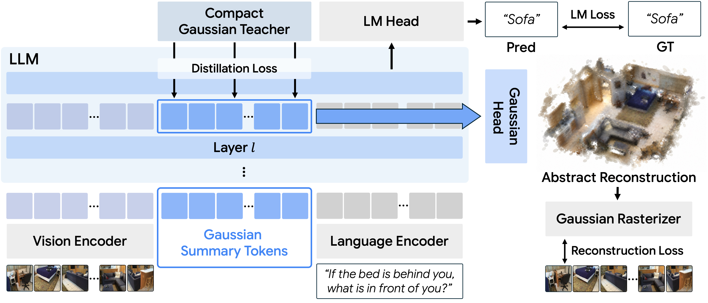

<div align="center">
  <h1>Imagine3D-LLM: Teaching MLLMs to Imagine 3D Scenes Before Answering</h1>
</div>

<div align="center">
  <a href="https://crepejung00.github.io/">Jaewoo Jung</a><sup>1,2,*</sup>,
  Hyeonseo Yu<sup>1</sup>,
  <a href="https://hg010303.github.io/">Honggyu An</a><sup>1</sup>,
  <a href="https://onground-korea.github.io/">Jisang Han</a><sup>1</sup>,
  Mungyeom Kim<sup>1</sup><br>
  <a href="https://sites.google.com/view/minjeon/home?pli=1&amp;authuser=0">Minkyeong Jeon</a><sup>1</sup>,
  <a href="https://hsshin98.github.io/">Heeseong Shin</a><sup>1</sup>,
  <a href="https://wjun0830.github.io/">WonJun Moon</a><sup>1</sup>,
  <a href="https://federicotombari.github.io/">Federico Tombari</a><sup>3,4</sup>,
  <a href="https://danini.github.io/">Daniel Barath</a><sup>2</sup><br>
  <a href="https://people.inf.ethz.ch/marc.pollefeys/">Marc Pollefeys</a><sup>2,†</sup>,
  <a href="https://cvlab.kaist.ac.kr/members/faculty">Seungryong Kim</a><sup>1,†</sup>,
  <a href="https://sunghwanhong.github.io/">Sunghwan Hong</a><sup>2,5,†</sup><br><br>
  <sup>1</sup>KAIST AI · <sup>2</sup>ETH Zürich · <sup>3</sup>Google · <sup>4</sup>TUM · <sup>5</sup>ETH AI Center<br>
  <sup>*</sup>Work done as a visiting researcher at ETH Zürich · <sup>†</sup>Co-corresponding authors
</div>

<br>
<br>

<p align="center">
  <a href="https://cvlab-kaist.github.io/Imagine3D-LLM/" target="_blank" rel="noopener noreferrer" style="display: inline-block;"></a>&nbsp;
  <a href="https://arxiv.org/abs/xxxx.xxxxx" target="_blank" rel="noopener noreferrer" style="display: inline-block;"></a>&nbsp;
  <!-- <a href="https://huggingface.co/xxx" target="_blank" rel="noopener noreferrer" style="display: inline-block;"></a>&nbsp; -->
</p>

<br>

## Abstract

**Imagine3D-LLM** teaches multimodal large language models to **coarsely imagine 3D scenes before answering** questions about multi-view images. Inspired by human spatial reasoning, it introduces learnable Gaussian summary tokens that gather evidence across views into a compact scene representation. These tokens are decoded into 3D Gaussians and trained jointly with reconstruction and language-modeling objectives, while distillation from a compact Gaussian teacher accelerates training. Learning to reconstruct also improves the model’s internal representations, encouraging object-level grouping and stronger cross-view correspondence without explicit supervision for either. Imagine3D-LLM achieves consistent gains across spatial reasoning and 3D understanding benchmarks.

<div align="center">
  
</div>


## What to expect

- [ ] 🛠️ Training and evaluation code & scripts
- [ ] 🌍 An easy-to-use demo taking multi-view RGB images as input

## Citation

```bibtex

```
